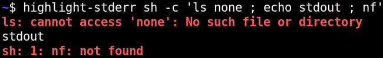

# `highlight-stderr`

`highlight-stderr` runs a command and highlights the stderr of that command,
while preserving the order of stdout and stderr. It sends both stdout and
stderr of the command to its stdout, making it easy to pipe to a pager or
similar.

By default, `highlight-stderr` will highlight stderr in bold red, and leave
stdout normal. However, you can configure `highlight-stderr` using the
environment variables `HIGHLIGHT_STDERR` and `HIGHLIGHT_STDOUT`, which can each
contain a color specification in git's color specification format, such as
`bold white red`.

`highlight-stderr` uses [`io-mux`](https://crates.io/crates/io-mux) to capture
the stdout and stderr of the command. Like `io-mux`, `highlight-stderr` only
runs on Linux.
